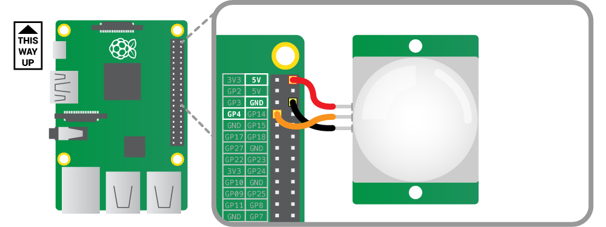

# Home monitoring with a Raspberry Pi and sending notifications with a Telegram bot 
[](https://github.com/m0by314/RaspberryPi_home_surveillance/actions?query=workflow%3ACI)

Tutorial to build a home surveillance system with a raspberry PI and a Telegram bot to send alerts.

### How it works

- When a movement is detected, the application records a video that is sent to your phone by the Telegram bot.  
- Once installed, the surveillance system is managed from your smartphone with [bot commands](#Bots-commands) from the Telegram app.  
- The system is started by a systemd service activated at boot time

### Prerequisites.

* Raspberry Pi Camera Module  
* PIR motion sensor module   
* 3 female-to-female jumper wires   
* [Tutorial for create your Telegram Bot](https://core.telegram.org/bots#3-how-do-i-create-a-bot)  
* After starting the bot on your smartphone, you must retrieve your chat_id at the following address:   
    * https://api.telegram.org/bot<token_id>/getUpdates

### Connect the PIR sensor



## Setting up the camera hardware
```
sudo raspi-config nonint do_camera 0
```
After this action reboot the raspberry

## Setup
   
 * Open the `config.py` file and configure the TOKEN_ID and CHAT_ID variables with your token_id and your chat_id  
 ```
     # Variable to configure
     TOKEN_ID = 'Your token_id'
     CHAT_ID = 'Your chat_id'
```

### Installing 

Before installing set your token_id then:
```
make install
```

### Bot's commands

* /start  : start the home monitoring system 
* /stop   : stop the home monitoring system  
* /status : show the status of the monitoring system 
* /photo  : take a picture 
* /video time=<delay> : records a video, argument time defines the duration of the recording
* /clean  : remove all files in video folder
* /help   : show help 
  
### Details 		

  * By default, the duration of the video is set to 60s. If you want change this, you need to modify the VIDEO_TIME constant in `config.py`    		

  * It's possible to add other commands to the bot in `app.py` with the decorator @bot.handler()		
 ```		
 @bot.handler("/hello")		
 def func_hello():		
     return bot.send_message("Hello World")		
 ```
 
### Testing
 
```
make test
```

### Uninstall
 
```
make uninstall
```

## Built With

* [gpiozero](https://pypi.org/project/gpiozero/)
* [telepot](https://pypi.org/project/telepot/)  
* [picamera](https://pypi.org/project/picamera/) 
